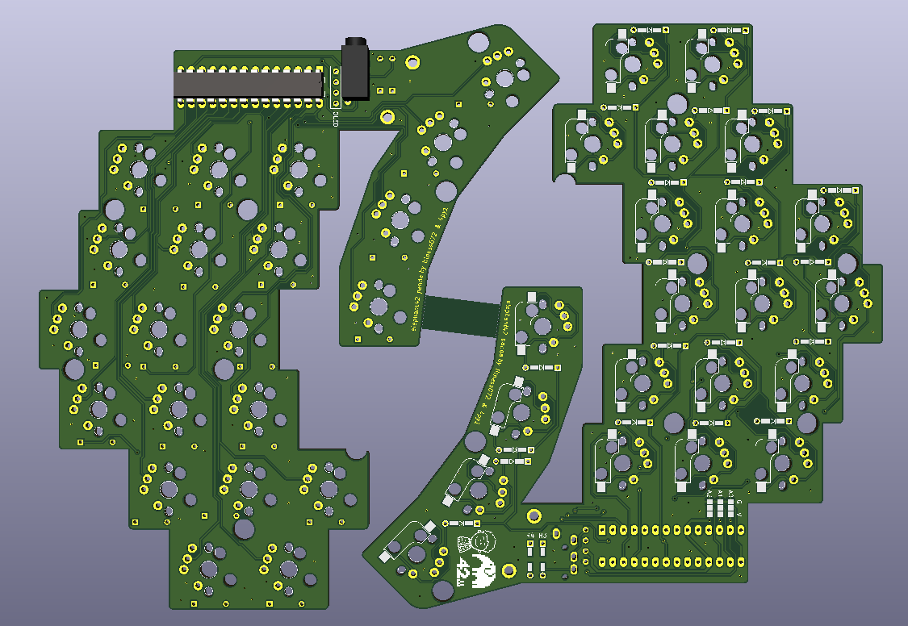
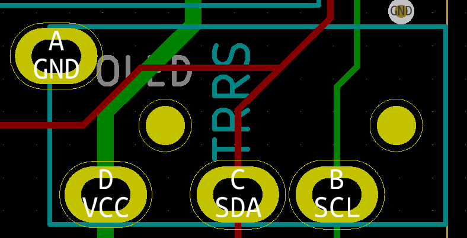

# elephant42 panda(🐘🐼)

## pcb

Depends on the illness072

  - https://github.com/illness072/elephant42

## license?

Beerware!!

Come drink beer in Tokyo with me!! 🍺🍺🍺

# product description

An elephant42 that uses the I/O EXPANDER MCP23017 instead of ProMicro.

I named it an elephant42 panda because it looked like a expander and panda.

It's a very interesting name.

# expander pin

row: A0 , A1

col: A2, A3, A4, A5, A6, A7, B0, B1, B2, B3, B4, B5

# expander pin

